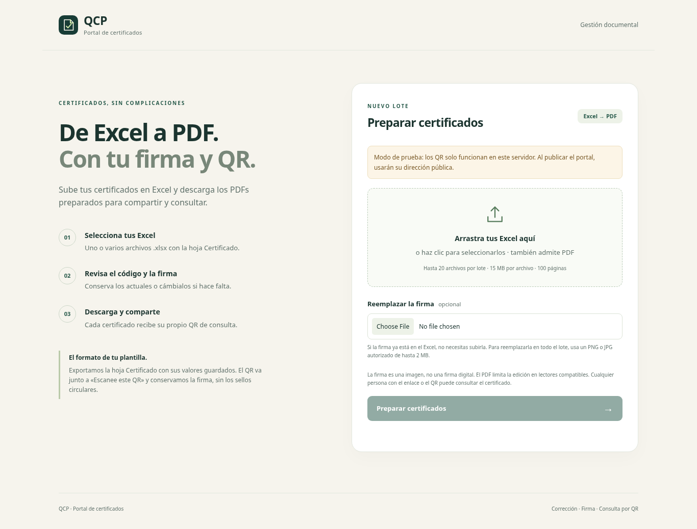

# Portal de certificados QCP

Aplicación web en español para preparar certificados PDF por lotes. Basada en el comportamiento del flujo n8n **«Portal certificados QCP - lotes dinámicos v3»**, con una implementación independiente: no necesita n8n, QuickChart ni el servicio externo `pdf-code-fixer`.



## Qué hace

- Recibe hasta 20 PDFs por lote desde el navegador, procesados uno a uno. Cada PDF admite 15 MB y 100 páginas.
- Detecta códigos `QCP-0000-0000`. Si existe un único código distinto, permite reemplazar todas sus apariciones por el código solicitado. Conserva el nombre del archivo.
- Si hay varios códigos, los conserva y muestra una advertencia. Si no encuentra texto editable, no inventa ni corrige códigos. No incluye OCR.
- Genera un QR localmente y lo inserta en zonas libres del documento. Prioriza espacios debajo de textos guía de verificación y luego el pie de página. Si ninguna página tiene espacio, añade una página de consulta. Nunca coloca elementos sobre contenido detectado.
- Permite añadir una imagen PNG/JPG de firma autorizada; es opcional y se aplica al lote. La firma no se almacena como archivo independiente.
- Aplica cifrado AES-256 con apertura sin contraseña y permisos que limitan edición y copia en lectores compatibles. Permite imprimir. Esos permisos no garantizan que otros programas no puedan modificar el PDF.
- Guarda el PDF final y sus metadatos en el servidor. El QR apunta a una página pública de consulta y descarga. La página muestra un hash SHA-256 del archivo.
- Rechaza PDFs con contraseña o campos de firma digital para no invalidarlos silenciosamente.

**La imagen de firma, el QR y el registro no constituyen una firma digital ni acreditan la identidad del emisor.** La sustitución de códigos conserva tamaño/color y aproxima la fuente con fuentes PDF estándar; documentos con tipografías especiales deben revisarse visualmente. Texto girado que requiera corrección se rechaza.

## Ejecutar en desarrollo

Requisitos: Python **3.12** y [uv](https://docs.astral.sh/uv/). Utiliza el checkout existente; no es necesario crear otro worktree.

```sh
cd /workspace/Chamba
sh scripts/install.sh
sh scripts/start.sh
```

En una instalación local fuera de Codex, entra en el directorio clonado de Chamba. El servidor escucha en el puerto 8000. Para cambiarlo, exporta `PORT` y `PUBLIC_BASE_URL` antes de arrancar. En desarrollo el origen por defecto es `http://127.0.0.1:8000`; los QR de ese modo sirven únicamente para pruebas en la máquina del servidor.

El archivo `.env.example` documenta los nombres de variables; **la aplicación no carga archivos `.env` automáticamente**. Exporta las variables o configúralas en tu proveedor. Nunca guardes claves ni PDFs de clientes en Git.

Para probar sin documentos reales, genera un PDF ficticio de dos páginas, súbelo al portal y solicita el código `QCP-2026-0099`:

```sh
.venv/bin/python scripts/create_demo.py --output /tmp/qcp-demo.pdf
```

## Validar

```sh
cd /workspace/Chamba
.venv/bin/python -m pytest -q
```

Las pruebas generan PDFs ficticios; comprueban la carga, corrección en todas las páginas, conservación de contenido, decodificación del QR real, inserción de firma, permisos PDF, almacenamiento, descarga, autenticación y casos de error. No utilizan certificados de clientes.

Con el servidor arrancado, comprueba además una carga y descarga reales:

```sh
.venv/bin/python scripts/smoke.py
```

Esta comprobación guarda un certificado ficticio marcado SIN VALIDEZ. Usa `--url https://tu-portal.example.com` para comprobar una publicación; lee la clave de acceso de `PORTAL_ACCESS_KEY` sin imprimirla.

## Publicar para obtener un enlace

El repositorio y la publicación web son cosas distintas: subir este código a GitHub **no inicia un servidor web**. Esta aplicación necesita un servidor Python con disco persistente; GitHub Pages no ejecuta este backend.

Puedes desplegar el `Dockerfile` en un proveedor que admita contenedores y almacenamiento persistente, por ejemplo un servicio web Docker en Render:

1. Conecta este repositorio y selecciona la rama `main` y el runtime Docker.
2. Configura `PORTAL_ACCESS_KEY` como secreto de al menos 16 caracteres para habilitar el procesamiento. La página pública arranca incluso si falta esta clave o es demasiado corta; en ese caso muestra un aviso y bloquea las cargas. La clave se introduce en el portal para preparar documentos; no se exige a quien consulta un certificado mediante su QR.
3. Configura `PUBLIC_BASE_URL` con la dirección **HTTPS** del servicio, sin barra final ni ruta. En Render también se acepta su variable automática `RENDER_EXTERNAL_URL` si no defines `PUBLIC_BASE_URL`.
4. Monta un **disco persistente** en `/data`, escribible por el usuario del contenedor (UID 10001). El proveedor puede cobrar por el servicio o el disco; revisa su precio antes de crear recursos.
5. Usa `/healthz` como comprobación de salud. Abre la página y procesa un PDF ficticio; descarga el resultado, escanea su QR desde otro dispositivo y comprueba que abre la página de consulta.

Los procesos no sobreviven a un reinicio; el proveedor debe arrancar el contenedor nuevamente. Los archivos deben sobrevivir en el disco. Prueba un reinicio y confirma que un certificado anterior sigue disponible antes de utilizar documentos reales. No cambies el dominio después de emitir certificados: los QR existentes conservarán el dominio con el que fueron generados.

También puedes usar Docker en una máquina propia:

```sh
docker build -t chamba-qcp .
docker run --rm -p 8000:8000 --mount type=volume,source=qcp-data,target=/data chamba-qcp
```

Ese ejemplo es para pruebas locales. Para publicación usa HTTPS, la URL pública, la clave de acceso y un proxy frontal. `PUBLIC_BASE_URL` determina los QR; no se confía en encabezados de origen enviados por clientes.

### Variables

| Nombre | Uso |
| --- | --- |
| `PUBLIC_BASE_URL` | Origen HTTPS del portal publicado. Por defecto, origen local de pruebas. |
| `PORTAL_ACCESS_KEY` | Secreto para subir/procesar documentos en un origen público, mínimo de 16 caracteres. Sin clave válida, la página se puede visualizar y consultar; las cargas quedan bloqueadas. |
| `CERTIFICATE_STORAGE_DIR` | Directorio de certificados. Por defecto `data/certificates`; en Docker `/data/certificates`. |
| `MAX_STORAGE_MB` | Cuota total del directorio. Por defecto 1024 MB; no elimina archivos automáticamente. |
| `PORT` | Puerto de escucha. Por defecto 8000. |

Los enlaces usan identificadores aleatorios, pero **cualquier persona que tenga el enlace o el QR puede descargar el certificado**, igual que la opción «cualquiera con el enlace» del flujo original. Haz copias de seguridad del directorio de almacenamiento; borrarlo rompe los enlaces emitidos. Utiliza una única instancia y un único worker con ese disco. Para escalar a varias instancias se necesitaría almacenamiento compartido y una base de datos.

## Diferencias respecto al JSON original

Google Drive queda pendiente por decisión del usuario: esta versión guarda archivos en el servidor y los QR apuntan al portal. El código del servicio `pdf-code-fixer` no estaba incluido; el procesamiento se implementa aquí con PyMuPDF. No se presupone la existencia de `firmaluis.png`: la persona carga una firma autorizada en la interfaz.

El QR verifica la disponibilidad de la copia registrada, no la autenticidad del contenido. El código original no incluía la interfaz ni la implementación del servicio PDF; esta aplicación aporta ambos componentes con las limitaciones documentadas arriba.
